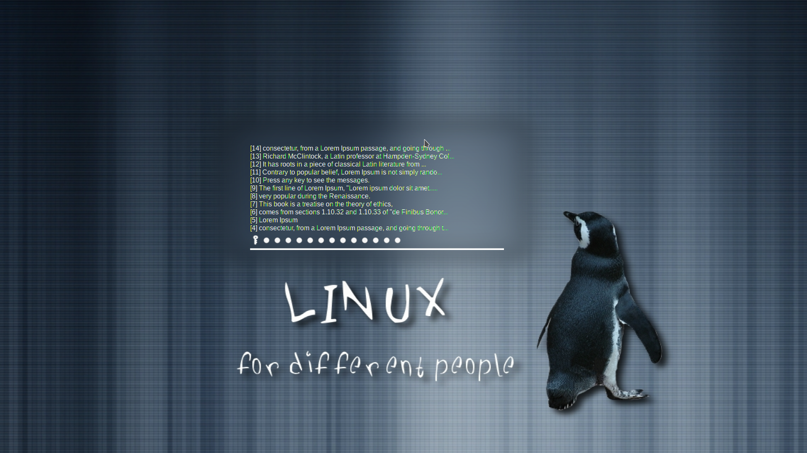

# Different Tux - Plymouth's Theme

I am sharing here my own [Plymouth](https://www.freedesktop.org/wiki/Software/Plymouth/)'s theme, i.e., a theme that I generated to use in my Desktop.

It was tested on Ubuntu 20.04.


## How to use it

### Creating a deb package and installing it:
```sh
$ sudo apt-get install git debian-builder
$ mkdir ~/plymouth-theme
$ cd ~/plymouth-theme
$ git clone https://github.com/jeiks/plymouth-theme.git
$ cd plymouth-theme
$ rm -f theme-preview.png README.md
$ debuild -sa
$ cd ..
$ sudo dpkg -i plymouth-jeiks-theme_1.0-1_amd64.deb
```
Installing this package (.deb file) is a good option, because the package will automatically set this theme as default and also update the initramfs file.

If you need, you can check if the different-tux theme is the default by using the following command:
```sh
$ sudo update-alternatives --config default.plymouth
```
And you have to see the different-tux theme masked with an asterisk (*):
```sh
There are 2 choices for the alternative default.plymouth (providing /usr/share/plymouth/themes/default.plymouth).

  Selection    Path                                                             Priority   Status
------------------------------------------------------------
* 0            /usr/share/plymouth/themes/different-tux/different-tux.plymouth   200       auto mode
  1            /usr/share/plymouth/themes/different-tux/different-tux.plymouth   200       manual mode
  2            /usr/share/plymouth/themes/kubuntu-logo/kubuntu-logo.plymouth     150       manual mode

Press <enter> to keep the current choice[*], or type selection number:
```

To select other theme, you must type the desired theme number and press ENTER.

And to remove the package (and theme):
```sh
sudo dpkg -r plymouth-jeiks-theme
```

### Setting everything by hands (=D)

You have to follow these steps (the explantion is on shell comments, i.e., lines starting with "#"):
```sh
# Install git, clone this repository and enter on this cloned folder:
$ sudo apt-get install git
$ cd /tmp
$ git clone https://github.com/jeiks/plymouth-theme.git
$ cd plymouth-theme
# Installing the different-tux directory on /usr/share/plymouth/themes:
$ sudo make install
# Creating an alternative to select different tux as Plymouth's default theme:
$ sudo update-alternatives --install \
     /usr/share/plymouth/themes/default.plymouth default.plymouth \
     /usr/share/plymouth/themes/different-tux/different-tux.plymouth 200
# Cheking if it is the default (it has to be marked by an asterisk "*"):
$ sudo update-alternatives --config default.plymouth
# Updating the initramfs
$ sudo update-initramfs -u
```

And to remove:
```sh
$ sudo update-alternatives --remove default.plymouth \
     /usr/share/plymouth/themes/different-tux/different-tux.plymouth
$ sudo update-initramfs -u
$ sudo rm -rf /usr/share/plymouth/themes/different-tux
```
